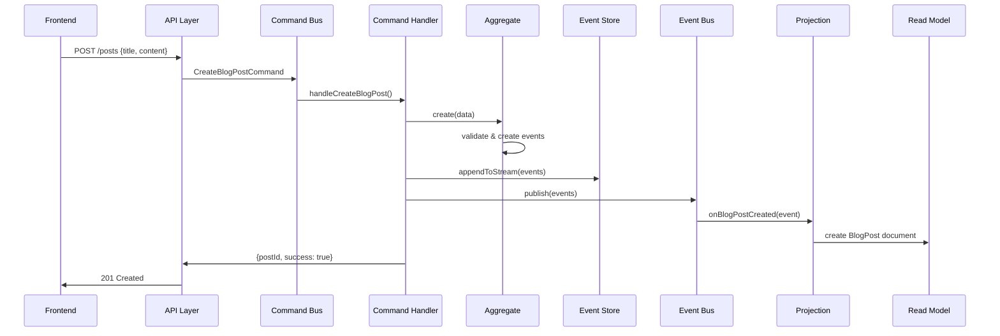
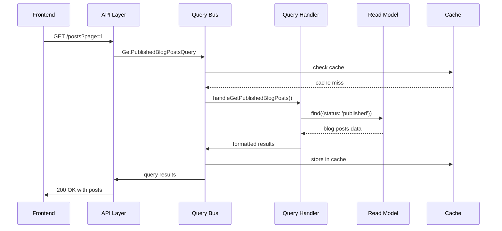
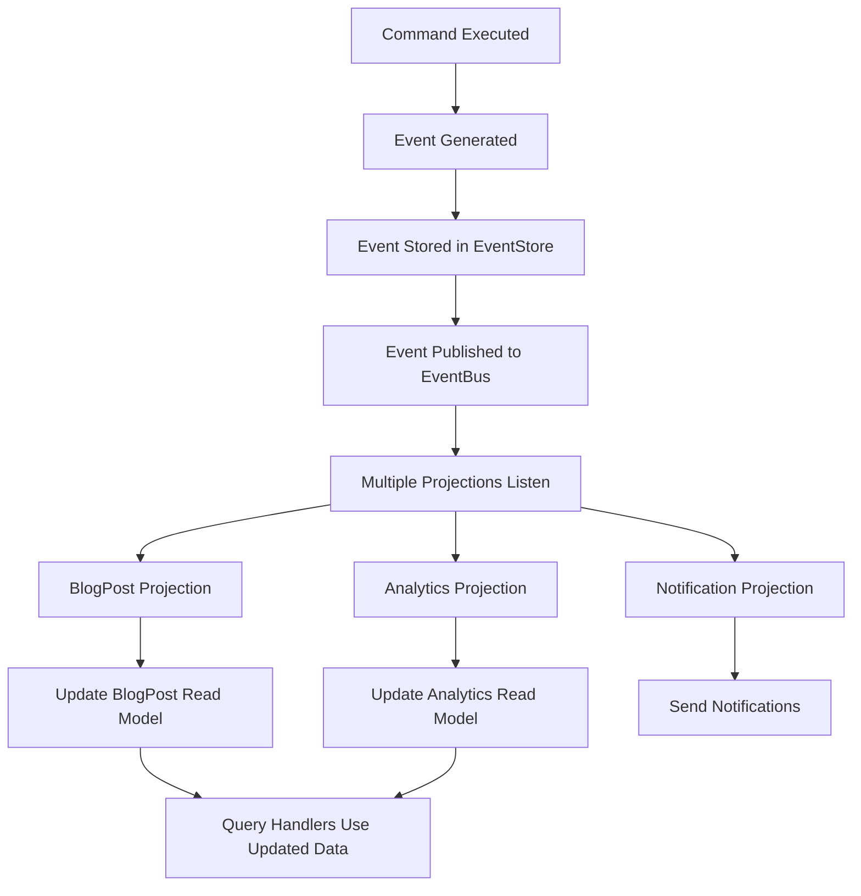

# Implementation Guide: CQRS & Event-Driven Architecture

This guide explains the key implementation details of the CyberSec & IAM Blog, built with pure CQRS and Event-Driven Architecture patterns.

## Table of Contents

1. [Architecture Overview](#architecture-overview)
2. [CQRS Implementation](#cqrs-implementation)
3. [Event Sourcing](#event-sourcing)
4. [Domain Layer](#domain-layer)
5. [Application Layer](#application-layer)
6. [Infrastructure Layer](#infrastructure-layer)
7. [Read Models & Projections](#read-models--projections)
8. [API Layer](#api-layer)
9. [Frontend Architecture](#frontend-architecture)
10. [Data Flow Examples](#data-flow-examples)
11. [Best Practices](#best-practices)

## Architecture Overview

### Core Principles

The application follows these fundamental principles:

- **Command Query Responsibility Segregation (CQRS)**: Complete separation between write operations (commands) and read operations (queries)
- **Event Sourcing**: All state changes are captured as immutable events
- **Event-Driven Architecture**: Components communicate through domain events
- **No CRUD Operations**: Traditional Create, Read, Update, Delete operations are replaced with Commands and Queries
- **Eventual Consistency**: Read models are eventually consistent with the event store

### System Components

```
┌─────────────────┐    ┌─────────────────┐    ┌─────────────────┐
│   Frontend      │    │   Backend       │    │  Infrastructure │
│   (React)       │    │   (Node.js)     │    │                 │
├─────────────────┤    ├─────────────────┤    ├─────────────────┤
│ • Components    │    │ • API Routes    │    │ • EventStore DB │
│ • Pages         │◄──►│ • Command Bus   │◄──►│ • MongoDB       │
│ • Services      │    │ • Query Bus     │    │ • Redis         │
│ • State Mgmt    │    │ • Event Bus     │    │ • Docker        │
└─────────────────┘    └─────────────────┘    └─────────────────┘
```

## CQRS Implementation

### Command Side (Write Operations)

Commands represent intentions to change the system state. They are handled by Command Handlers that validate business rules and emit events.

#### Command Structure

```javascript
// src/backend/domain/commands/BlogCommands.js
class CreateBlogPostCommand extends Command {
  constructor(data, metadata = {}) {
    super('CreateBlogPost', data, metadata);
    
    // Validate required fields
    if (!data.title || !data.content || !data.authorId) {
      throw new Error('CreateBlogPost command requires title, content, and authorId');
    }
  }
}
```

**Key Features:**
- Immutable command objects
- Built-in validation
- Unique command IDs for tracing
- Metadata for audit trails

#### Command Bus

```javascript
// src/backend/infrastructure/CommandBus.js
class CommandBus {
  async execute(command) {
    const handler = this.handlers.get(command.type);
    if (!handler) {
      throw new Error(`No handler registered for command type: ${command.type}`);
    }

    // Execute middlewares (validation, auth, logging)
    let context = { command, metadata: {} };
    for (const middleware of this.middlewares) {
      context = await middleware(context);
    }

    // Execute the command handler
    return await handler(context.command, context.metadata);
  }
}
```

**Features:**
- Centralized command routing
- Middleware pipeline for cross-cutting concerns
- Error handling and logging
- Command validation

### Query Side (Read Operations)

Queries retrieve data from optimized read models without affecting the write side.

#### Query Structure

```javascript
// Example query execution
const query = {
  type: 'GetPublishedBlogPosts',
  parameters: {
    page: 1,
    limit: 10,
    sortBy: 'publishedAt',
    sortOrder: 'desc'
  }
};

const result = await queryBus.execute(query);
```

#### Query Bus

```javascript
// src/backend/infrastructure/QueryBus.js
class QueryBus {
  async execute(query) {
    const handler = this.handlers.get(query.type);
    
    // Execute middlewares (caching, auth, performance monitoring)
    let context = { query, metadata: {} };
    for (const middleware of this.middlewares) {
      context = await middleware(context);
    }

    // Check cache first
    if (context.cachedResult) {
      return context.cachedResult;
    }

    // Execute query handler
    const result = await handler(context.query, context.metadata);
    
    // Cache result if applicable
    if (context.cacheKey) {
      await cacheService.set(context.cacheKey, result);
    }

    return result;
  }
}
```

## Event Sourcing

### Event Store

All state changes are persisted as events in EventStore DB, providing:

- **Complete Audit Trail**: Every change is recorded
- **Temporal Queries**: Query state at any point in time
- **Replay Capability**: Rebuild read models from events
- **Debugging**: Full history of what happened

#### Event Structure

```javascript
// src/backend/domain/events/BlogEvents.js
class BlogPostCreatedEvent extends Event {
  constructor(data, metadata = {}) {
    super('BlogPostCreated', data, metadata);
  }
}

// Event data example
{
  eventId: "550e8400-e29b-41d4-a716-446655440001",
  type: "BlogPostCreated",
  timestamp: "2024-01-15T10:30:00.000Z",
  data: {
    postId: "post-123",
    title: "Advanced IAM Strategies",
    content: "...",
    authorId: "author-456",
    tags: ["iam", "security"]
  },
  metadata: {
    userId: "author-456",
    ipAddress: "192.168.1.1",
    userAgent: "Mozilla/5.0..."
  }
}
```

#### Event Store Operations

```javascript
// src/backend/infrastructure/EventStore.js
class EventStore {
  async appendToStream(streamName, events, expectedRevision = 'any') {
    const eventData = events.map(event => 
      jsonEvent({
        type: event.type,
        data: event.data,
        metadata: {
          ...event.metadata,
          timestamp: new Date().toISOString(),
          eventId: uuidv4()
        }
      })
    );

    return await this.client.appendToStream(streamName, eventData, { expectedRevision });
  }

  async readStream(streamName, options = {}) {
    const events = [];
    const eventStream = this.client.readStream(streamName, options);

    for await (const event of eventStream) {
      events.push({
        eventId: event.event.id,
        eventType: event.event.type,
        data: event.event.data,
        metadata: event.event.metadata,
        streamId: event.event.streamId,
        revision: event.event.revision,
        created: event.event.created
      });
    }

    return events;
  }
}
```

## Domain Layer

### Aggregates

Aggregates encapsulate business logic and ensure consistency within their boundaries.

#### BlogPostAggregate Example

```javascript
// src/backend/domain/aggregates/BlogPostAggregate.js
class BlogPostAggregate {
  constructor() {
    this.id = null;
    this.title = null;
    this.content = null;
    this.status = 'draft';
    this.uncommittedEvents = [];
  }

  // Business logic methods
  create(data) {
    if (this.id) {
      throw new Error('Blog post already exists');
    }

    const postId = uuidv4();
    const event = new BlogPostCreatedEvent({
      postId,
      title: data.title,
      content: data.content,
      authorId: data.authorId,
      createdAt: new Date().toISOString()
    });

    this.raiseEvent(event);
    return postId;
  }

  publish(authorId) {
    if (this.authorId !== authorId) {
      throw new Error('Only the author can publish this post');
    }
    if (this.status === 'published') {
      throw new Error('Blog post is already published');
    }

    const event = new BlogPostPublishedEvent({
      postId: this.id,
      authorId,
      publishedAt: new Date().toISOString()
    });

    this.raiseEvent(event);
  }

  // Event application
  apply(event) {
    switch (event.type) {
      case 'BlogPostCreated':
        this.onBlogPostCreated(event);
        break;
      case 'BlogPostPublished':
        this.onBlogPostPublished(event);
        break;
    }
    this.version++;
  }

  raiseEvent(event) {
    this.apply(event);
    this.uncommittedEvents.push(event);
  }
}
```

**Key Concepts:**
- **Invariant Enforcement**: Business rules are enforced within aggregates
- **Event Sourcing**: State is derived from events, not stored directly
- **Optimistic Concurrency**: Version numbers prevent concurrent modification issues
- **Uncommitted Events**: Events are collected and persisted as a batch

## Application Layer

### Command Handlers

Command handlers orchestrate the execution of business operations.

```javascript
// src/backend/application/commandHandlers/BlogPostCommandHandlers.js
class BlogPostCommandHandlers {
  async handleCreateBlogPost(command) {
    // 1. Create new aggregate
    const aggregate = new BlogPostAggregate();
    
    // 2. Execute business logic
    const postId = aggregate.create(command.data);

    // 3. Save events to event store
    const streamName = `blogpost-${postId}`;
    const events = aggregate.getUncommittedEvents();
    await this.eventStore.appendToStream(streamName, events);
    
    // 4. Publish events to event bus
    for (const event of events) {
      await this.eventBus.publish({
        ...event,
        streamId: streamName
      });
    }

    // 5. Mark events as committed
    aggregate.markEventsAsCommitted();

    return { postId, success: true };
  }

  async handleUpdateBlogPost(command) {
    const { postId } = command.data;
    const streamName = `blogpost-${postId}`;

    // 1. Load aggregate from events
    const events = await this.eventStore.readStream(streamName);
    if (events.length === 0) {
      throw new Error('Blog post not found');
    }

    // 2. Reconstruct aggregate state
    const aggregate = BlogPostAggregate.fromEvents(events);
    
    // 3. Execute business logic
    aggregate.update(command.data);

    // 4. Save new events
    const newEvents = aggregate.getUncommittedEvents();
    if (newEvents.length > 0) {
      await this.eventStore.appendToStream(streamName, newEvents, events.length - 1);
      
      // 5. Publish events
      for (const event of newEvents) {
        await this.eventBus.publish({
          ...event,
          streamId: streamName
        });
      }
    }

    return { postId, success: true };
  }
}
```

### Query Handlers

Query handlers retrieve data from read models optimized for specific use cases.

```javascript
// src/backend/application/queryHandlers/BlogPostQueryHandlers.js
class BlogPostQueryHandlers {
  async handleGetPublishedBlogPosts(query) {
    const { page = 1, limit = 10, sortBy = 'publishedAt', sortOrder = 'desc' } = query.parameters;

    const skip = (page - 1) * limit;
    const sort = { [sortBy]: sortOrder === 'desc' ? -1 : 1 };

    // Query optimized read model
    const posts = await this.readModelStore.find(
      'BlogPost',
      { status: 'published' },
      { sort, limit, skip }
    );

    const total = await this.readModelStore.count('BlogPost', { status: 'published' });

    return {
      posts: posts.map(post => this.formatBlogPost(post)),
      pagination: {
        page,
        limit,
        total,
        pages: Math.ceil(total / limit),
        hasNext: page * limit < total,
        hasPrev: page > 1
      }
    };
  }

  async handleSearchBlogPosts(query) {
    const { searchText, page = 1, limit = 10, filters = {} } = query.parameters;

    // Build search query with filters
    const searchQuery = {
      $text: { $search: searchText },
      status: 'published'
    };

    // Apply additional filters
    if (filters.categoryId) searchQuery.categoryId = filters.categoryId;
    if (filters.isSecurityRelated !== undefined) searchQuery.isSecurityRelated = filters.isSecurityRelated;

    // Execute search with text scoring
    const posts = await this.readModelStore.aggregate('BlogPost', [
      { $match: searchQuery },
      { $addFields: { score: { $meta: 'textScore' } } },
      { $sort: { score: { $meta: 'textScore' }, publishedAt: -1 } },
      { $skip: (page - 1) * limit },
      { $limit: limit }
    ]);

    return {
      posts: posts.map(post => this.formatBlogPost(post)),
      searchText,
      pagination: { /* ... */ }
    };
  }
}
```

## Infrastructure Layer

### Event Bus

The Event Bus handles event publishing and subscription for loose coupling between components.

```javascript
// src/backend/infrastructure/EventBus.js
class EventBus extends EventEmitter {
  registerProjection(projectionName, eventTypes, projectionHandler) {
    this.projections.set(projectionName, {
      eventTypes,
      handler: projectionHandler,
      isActive: true
    });

    // Register handlers for each event type
    eventTypes.forEach(eventType => {
      this.registerHandler(eventType, async (event) => {
        if (this.projections.get(projectionName)?.isActive) {
          await projectionHandler(event);
        }
      }, { name: `projection:${projectionName}`, priority: -1 });
    });
  }

  async publish(event) {
    // Execute middlewares
    let context = { event, metadata: {} };
    for (const middleware of this.middlewares) {
      context = await middleware(context);
    }

    // Get handlers for this event type
    const handlers = this.handlers.get(event.type) || [];
    
    // Execute all handlers in parallel
    const promises = handlers.map(async ({ handler, name }) => {
      try {
        await handler(context.event, context.metadata);
      } catch (error) {
        logger.error(`Event handler failed: ${name}`, { error: error.message });
        // Don't throw - we want other handlers to continue
      }
    });

    await Promise.allSettled(promises);
    
    // Emit for any additional listeners
    this.emit(event.type, context.event);
  }
}
```

### Read Model Store

Abstraction layer for read model persistence in MongoDB.

```javascript
// src/backend/infrastructure/ReadModelStore.js
class ReadModelStore {
  async find(modelName, query = {}, options = {}) {
    const Model = this.getModel(modelName);
    const { sort = {}, limit = 0, skip = 0, select = null, populate = null } = options;

    let queryBuilder = Model.find(query);

    if (select) queryBuilder = queryBuilder.select(select);
    if (sort) queryBuilder = queryBuilder.sort(sort);
    if (skip) queryBuilder = queryBuilder.skip(skip);
    if (limit) queryBuilder = queryBuilder.limit(limit);
    if (populate) queryBuilder = queryBuilder.populate(populate);

    return await queryBuilder.lean();
  }

  async textSearch(modelName, searchText, options = {}) {
    const Model = this.getModel(modelName);
    const { limit = 20, skip = 0, sort = { score: { $meta: 'textScore' } } } = options;

    return await Model
      .find(
        { $text: { $search: searchText } },
        { score: { $meta: 'textScore' } }
      )
      .sort(sort)
      .skip(skip)
      .limit(limit)
      .lean();
  }
}
```

## Read Models & Projections

### Read Model Schema

Read models are optimized for query performance with denormalized data and indexes.

```javascript
// src/backend/readModels/schemas/BlogPostReadModel.js
const BlogPostReadModelSchema = new mongoose.Schema({
  // Core blog post data
  postId: { type: String, required: true, unique: true, index: true },
  title: { type: String, required: true, index: true },
  content: { type: String, required: true },
  excerpt: { type: String, required: true },
  slug: { type: String, required: true, unique: true, index: true },
  
  // Denormalized author information
  authorId: { type: String, required: true, index: true },
  authorName: { type: String, required: true },
  authorEmail: { type: String, required: true },
  
  // Categorization
  categoryId: { type: String, index: true },
  tags: [{ type: String, index: true }],
  
  // Status and publishing
  status: { type: String, enum: ['draft', 'published', 'archived', 'deleted'], index: true },
  
  // Engagement metrics
  viewCount: { type: Number, default: 0, index: true },
  likeCount: { type: Number, default: 0 },
  shareCount: { type: Number, default: 0 },
  commentCount: { type: Number, default: 0 },
  
  // AI-powered categorization
  isSecurityRelated: { type: Boolean, default: false, index: true },
  isIAMRelated: { type: Boolean, default: false, index: true },
  
  // Search optimization
  searchText: { type: String, index: 'text' },
  popularityScore: { type: Number, default: 0, index: true }
});

// Compound indexes for common queries
BlogPostReadModelSchema.index({ status: 1, publishedAt: -1 });
BlogPostReadModelSchema.index({ isSecurityRelated: 1, status: 1 });
BlogPostReadModelSchema.index({ popularityScore: -1, status: 1 });

// Full-text search index with weights
BlogPostReadModelSchema.index({
  title: 'text',
  content: 'text',
  excerpt: 'text',
  tags: 'text'
}, {
  weights: { title: 10, excerpt: 5, tags: 3, content: 1 }
});
```

### Event Projections

Projections update read models in response to events.

```javascript
// src/backend/readModels/projections/BlogPostProjection.js
class BlogPostProjection {
  async onBlogPostCreated(event) {
    const { data } = event;
    
    const blogPost = {
      postId: data.postId,
      title: data.title,
      content: data.content,
      excerpt: data.excerpt,
      slug: data.slug,
      authorId: data.authorId,
      tags: data.tags || [],
      status: 'draft',
      createdAt: new Date(data.createdAt),
      searchText: this.buildSearchText(data),
      isSecurityRelated: this.isSecurityRelated(data),
      isIAMRelated: this.isIAMRelated(data),
      viewCount: 0,
      popularityScore: 0
    };

    await this.readModelStore.create('BlogPost', blogPost);
  }

  async onBlogPostPublished(event) {
    await this.readModelStore.updateOne(
      'BlogPost',
      { postId: event.data.postId },
      { 
        $set: { 
          status: 'published',
          publishedAt: new Date(event.data.publishedAt)
        },
        $inc: { version: 1 }
      }
    );
  }

  // AI-powered content categorization
  isSecurityRelated(data) {
    const securityKeywords = [
      'security', 'cybersecurity', 'vulnerability', 'threat', 'attack',
      'malware', 'phishing', 'encryption', 'firewall', 'penetration'
    ];
    
    const searchText = this.buildSearchText(data);
    return securityKeywords.some(keyword => 
      searchText.includes(keyword.toLowerCase())
    );
  }

  isIAMRelated(data) {
    const iamKeywords = [
      'iam', 'identity', 'access management', 'authentication',
      'authorization', 'oauth', 'saml', 'sso', 'rbac'
    ];
    
    const searchText = this.buildSearchText(data);
    return iamKeywords.some(keyword => 
      searchText.includes(keyword.toLowerCase())
    );
  }
}
```

## API Layer

### REST Endpoints with CQRS

The API layer translates HTTP requests into Commands and Queries.

```javascript
// src/backend/api/routes/blogRoutes.js
module.exports = (commandBus, queryBus) => {
  // Command endpoint - Create blog post
  router.post('/posts', authenticate, [
    body('title').notEmpty().withMessage('Title is required'),
    body('content').notEmpty().withMessage('Content is required')
  ], async (req, res) => {
    try {
      const command = {
        type: 'CreateBlogPost',
        data: {
          ...req.body,
          authorId: req.user.id
        },
        metadata: {
          userId: req.user.id,
          timestamp: new Date().toISOString(),
          ipAddress: req.ip,
          userAgent: req.get('User-Agent')
        }
      };

      const result = await commandBus.execute(command);
      
      res.status(201).json({
        success: true,
        message: 'Blog post created successfully',
        data: result
      });
    } catch (error) {
      res.status(500).json({
        success: false,
        message: error.message
      });
    }
  });

  // Query endpoint - Get blog posts
  router.get('/posts', [
    query('page').optional().isInt({ min: 1 }),
    query('limit').optional().isInt({ min: 1, max: 100 })
  ], async (req, res) => {
    try {
      const query = {
        type: 'GetPublishedBlogPosts',
        parameters: {
          page: parseInt(req.query.page) || 1,
          limit: parseInt(req.query.limit) || 10,
          sortBy: req.query.sortBy || 'publishedAt',
          sortOrder: req.query.sortOrder || 'desc'
        }
      };

      const result = await queryBus.execute(query);
      
      res.json({
        success: true,
        data: result
      });
    } catch (error) {
      res.status(500).json({
        success: false,
        message: error.message
      });
    }
  });

  return router;
};
```

## Frontend Architecture

### React Components with CQRS

The frontend uses React Query for data fetching and state management.

```javascript
// Frontend service layer
// src/services/api.js
export const blogApi = {
  // Query operations
  getPosts: async (params = {}) => {
    const response = await api.get('/blog/posts', { params });
    return response.data;
  },

  getPostBySlug: async (slug) => {
    const response = await api.get(`/blog/posts/slug/${slug}`);
    return response.data;
  },

  // Command operations
  createPost: async (postData) => {
    const response = await api.post('/blog/posts', postData);
    return response.data;
  },

  publishPost: async (id) => {
    const response = await api.post(`/blog/posts/${id}/publish`);
    return response.data;
  }
};

// React component using React Query
// src/components/Blog/BlogList.jsx
export default function BlogList() {
  const [searchParams] = useSearchParams();
  const currentPage = parseInt(searchParams.get('page')) || 1;

  // Query for blog posts
  const { data, isLoading, error } = useQuery(
    ['blog-posts', currentPage],
    () => blogApi.getPosts({
      page: currentPage,
      limit: 12,
      sortBy: 'publishedAt',
      sortOrder: 'desc'
    }),
    {
      keepPreviousData: true,
      staleTime: 2 * 60 * 1000, // 2 minutes
    }
  );

  // Command for creating posts
  const createPostMutation = useMutation(blogApi.createPost, {
    onSuccess: () => {
      queryClient.invalidateQueries(['blog-posts']);
      toast.success('Post created successfully!');
    },
    onError: (error) => {
      toast.error(error.response?.data?.message || 'Failed to create post');
    }
  });

  return (
    <div>
      {/* Render blog posts */}
    </div>
  );
}
```

## Data Flow Examples

### Creating a Blog Post



### Reading Blog Posts



### Event Processing Flow



## Best Practices

### 1. Command Design

```javascript
// ✅ Good: Specific, intention-revealing commands
class PublishBlogPostCommand extends Command {
  constructor(data, metadata = {}) {
    super('PublishBlogPost', data, metadata);
    
    if (!data.postId || !data.authorId) {
      throw new Error('PublishBlogPost requires postId and authorId');
    }
  }
}

// ❌ Bad: Generic, unclear commands
class UpdateBlogPostCommand extends Command {
  constructor(data) {
    super('UpdateBlogPost', data);
    // No validation, unclear intent
  }
}
```

### 2. Event Design

```javascript
// ✅ Good: Past tense, immutable, rich with context
class BlogPostPublishedEvent extends Event {
  constructor(data, metadata = {}) {
    super('BlogPostPublished', {
      postId: data.postId,
      authorId: data.authorId,
      publishedAt: data.publishedAt,
      title: data.title, // Include relevant context
      categoryId: data.categoryId
    }, metadata);
  }
}

// ❌ Bad: Present tense, minimal data
class PublishBlogPostEvent extends Event {
  constructor(data) {
    super('PublishBlogPost', { postId: data.postId });
  }
}
```

### 3. Aggregate Design

```javascript
// ✅ Good: Encapsulates business logic, enforces invariants
class BlogPostAggregate {
  publish(authorId) {
    // Enforce business rules
    if (this.authorId !== authorId) {
      throw new Error('Only the author can publish this post');
    }
    if (this.status === 'published') {
      throw new Error('Post is already published');
    }
    if (!this.title || !this.content) {
      throw new Error('Post must have title and content to be published');
    }

    // Generate event
    const event = new BlogPostPublishedEvent({
      postId: this.id,
      authorId,
      publishedAt: new Date().toISOString()
    });

    this.raiseEvent(event);
  }
}
```

### 4. Error Handling

```javascript
// Command Handler with proper error handling
async handleCreateBlogPost(command) {
  try {
    // Validate command
    const { error } = createBlogPostSchema.validate(command.data);
    if (error) {
      throw new ValidationError(error.details[0].message);
    }

    // Execute business logic
    const aggregate = new BlogPostAggregate();
    const postId = aggregate.create(command.data);

    // Persist events
    const events = aggregate.getUncommittedEvents();
    await this.eventStore.appendToStream(`blogpost-${postId}`, events);

    // Publish events (fire and forget with error logging)
    this.publishEvents(events).catch(error => {
      logger.error('Failed to publish events', { error, postId });
    });

    return { postId, success: true };

  } catch (error) {
    logger.error('CreateBlogPost command failed', {
      commandId: command.id,
      error: error.message,
      stack: error.stack
    });
    
    // Re-throw with appropriate error type
    if (error instanceof ValidationError) {
      throw error;
    }
    throw new CommandExecutionError('Failed to create blog post', error);
  }
}
```

### 5. Testing Strategies

```javascript
// Testing aggregates with events
describe('BlogPostAggregate', () => {
  it('should publish a draft post', () => {
    // Given
    const aggregate = new BlogPostAggregate();
    const createEvent = new BlogPostCreatedEvent({
      postId: 'post-123',
      title: 'Test Post',
      content: 'Content',
      authorId: 'author-456'
    });
    aggregate.apply(createEvent);

    // When
    aggregate.publish('author-456');

    // Then
    const events = aggregate.getUncommittedEvents();
    expect(events).toHaveLength(1);
    expect(events[0]).toBeInstanceOf(BlogPostPublishedEvent);
    expect(events[0].data.postId).toBe('post-123');
    expect(aggregate.status).toBe('published');
  });
});

// Testing projections
describe('BlogPostProjection', () => {
  it('should create read model on BlogPostCreated', async () => {
    // Given
    const projection = new BlogPostProjection(mockReadModelStore);
    const event = new BlogPostCreatedEvent({
      postId: 'post-123',
      title: 'Test Post',
      content: 'Content'
    });

    // When
    await projection.onBlogPostCreated(event);

    // Then
    expect(mockReadModelStore.create).toHaveBeenCalledWith('BlogPost', 
      expect.objectContaining({
        postId: 'post-123',
        title: 'Test Post',
        status: 'draft'
      })
    );
  });
});
```

### 6. Performance Considerations

```javascript
// Efficient event processing
class EventBus {
  async publish(event) {
    // Get handlers for this event type
    const handlers = this.handlers.get(event.type) || [];
    
    // Execute handlers in parallel for better performance
    const promises = handlers.map(async ({ handler, name }) => {
      try {
        await handler(event);
      } catch (error) {
        // Log error but don't fail other handlers
        logger.error(`Handler ${name} failed`, { error, event });
      }
    });

    // Wait for all handlers to complete
    await Promise.allSettled(promises);
  }
}

// Optimized read model queries
class BlogPostQueryHandlers {
  async handleGetPopularPosts(query) {
    // Use compound index: { popularityScore: -1, status: 1 }
    return await this.readModelStore.find(
      'BlogPost',
      { status: 'published' },
      { 
        sort: { popularityScore: -1 },
        limit: query.parameters.limit,
        select: 'postId title excerpt authorName publishedAt viewCount' // Only select needed fields
      }
    );
  }
}
```

This implementation guide demonstrates how to build a robust, scalable application using CQRS and Event-Driven Architecture principles. The separation of concerns, event sourcing, and optimized read models provide a solid foundation for complex business applications while maintaining flexibility and performance.
